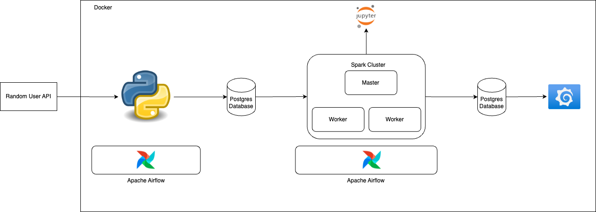

# Practical Data Engineering

Building data pipelines without sufficient guidance can be overwhelming. It can be particularly hard if you are the sole data engineer and have no one to provide feedback on your pipelines. It can be worse if you are starting out and were trusted with such responsibilities. Balancing deliverables and maintaining best practices can be challenging.

Also, you are expected to have a good amount of business understanding, the answer to why you are building what you are building. A good understanding of the product from an end-to-end user experience is also very important. You need to understand the impact your mistakes have on the business.

A modern data engineer is not only about reading data and storing it at some destination, maybe owing to the sophistication of the tooling that has now taken care of the undifferentiated heavy lifting that we needed to do before, but they are also, which is not an exhaustive list, expected to:

- Actively participate in the orchestration of the pipeline, the design itself.
- Building for security
- Have a fair amount of DevOps knowledge.
- Know more about the product they are building for.

One then has to develop skills and knowledge to be able to deliver on these expectations with as minimal friction as possible. This repo is for housing practical data engineering explorations while we clean up on industry best practice and learning principles to improve developer experience.

## Project 1: Simple ETL Service

This is a basic example where we run an ETL task simulating users that visit an application. We log their data in a postgres database and then visualize using Grafana.

## Project Architecture

### Data Flow Story

The random user API generates data that could be thought as belonging to a user of an app or website. We then use python within the airflow environment to connect to that API, collect data, then store it the postgres dabase. The postgres database schemas and tables are set up as code using python. We then use grafana to visualize the data

### Skills

| Skill          | Explanation                                                                          |
| -------------- | ------------------------------------------------------------------------------------ |
| Docker         | A platform designed to help developers build, share, and run container applications. |
| Python         | A high level interpreted programming language                                        |
| Postgres       | A relational database                                                                |
| Apache airflow | Open-Source orchestration tool                                                       |
| Grafana        | Open source visualization tool                                                       |

### Difficulty

3/10

## Best Data Engineering practices implemented

1. Version control with git and github

1. Object Oriented Programming (OOP)

1. Use of tests
